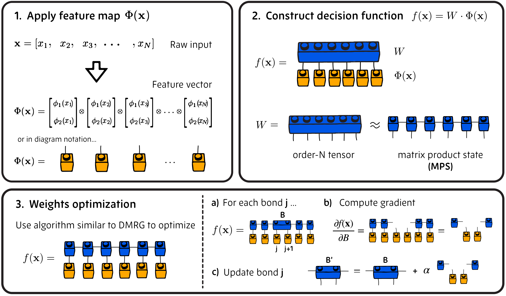

## Tensor network machine learning

**Mentor:** Alice Pagano

Tensor network algorithms extend beyond quantum many-body physics and find applications in various machine learning tasks. You can use tensor networks for directly solving the machine learning task, as datasets classification [1], or for compressing the size of a traditional machine learning model [2]. When used to solve a machine learning task, they are better than traditional machine learning models in a specific domain: *explainability*. Tensor networks do not display non-linearities, and are thus much easier to understand.

In this project, you will analyze the performances of a matrix product state (MPS)
ansatz to classify the MNIST dataset. You will use the MPS class in `quantum_tea_leaves`, and specifically, employ the optimization algorithm from Ref. [1]. The idea of the algorithm is sketched below. A feature map $`\Phi(x)`$ is applied to the input data. Then, the decision function is constructed and the weights are optimized via a sweeping algorithm similar to DMRG.

{width="800px"}

**Tasks:**

1. Successfully classify the digits $`3`$ and $`8`$ of the MNIST dataset using the MPS
classifier. Encode the dataset mapping each pixel in
a qubit with state:
```math
|q\rangle = \sqrt{1-p_i}\ket{0} + p_i \ket{1},
```
where $`|p_i|^2`$ is the (normalized) intensity of the pixel. We call this method MPS1.
What are the performances?

2. Successfully classify the digits $`3`$ and $`8`$ of the MNIST dataset using the MPS classifier. Encode the dataset in a statevector form, such as:
```math
    |\psi\rangle = \sum_i p_i \ket{i},
```
where $`|p_i|^2`$ is the (normalized) intensity of the pixel. We call this method MPS2. What are the performances?

3. By analyzing the entanglement entropy of the MPS classifier, are you able to understand which are the important characteristics of your system? Which of the two encodings is better for explainabilities? Does it become easier if you instead try to classify $`0`$ and $`1`$? How does the entanglement entropy and the accuracy vary with the bond dimension?

4. **[Optional]** Solve the same problem with your favorite neural network. Following Ref. [2] compress the weights of the neural network. Which method is better memory-wise? MPS1, MPS2, NN, or MPS-compressed NN?

**References:**

[1] E. Stoudenmire and D. J. Schwab, Advances in neural information processing systems 29 (2016)

[2] Y. Qing et al., arXiv preprint arXiv:2305.06058 (2023)